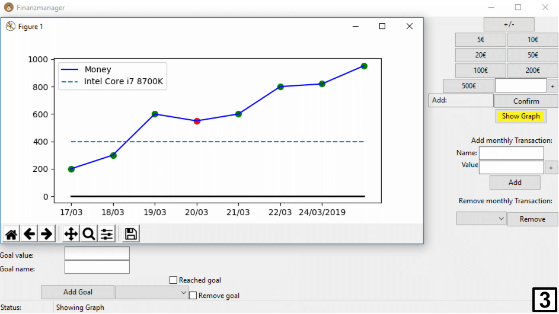

# Financemanager
Manage your finances with this application. Add how much you made/lost today, your financial goals, your monthly transactions and click on a button, to be shown a graph depicting your financial situation

dependencies: Here are all the .csv-files stored, that store valuable information for the programm in order to run properly

graph-->value_manager: Here are all the functions that write, append or read .csv files.

graph-->graph_draw: Here, the graph gets drawn, based on the values of the .csv-files

gui-->GUI: Here is the GUI that combines all the elements, if you want to start the programm, open and start GUI.py
